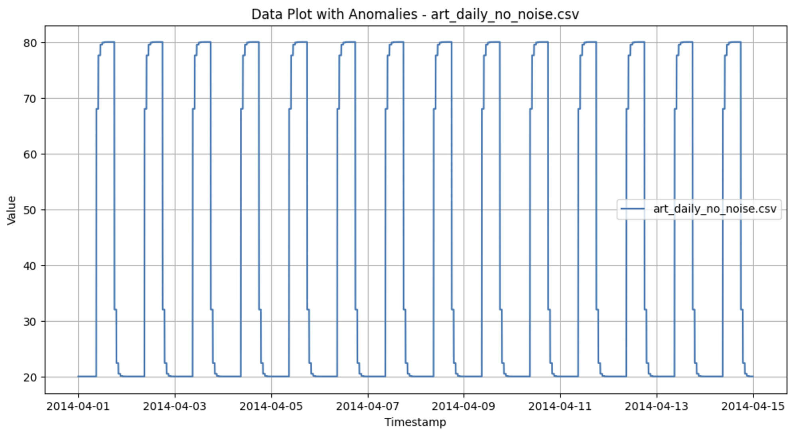
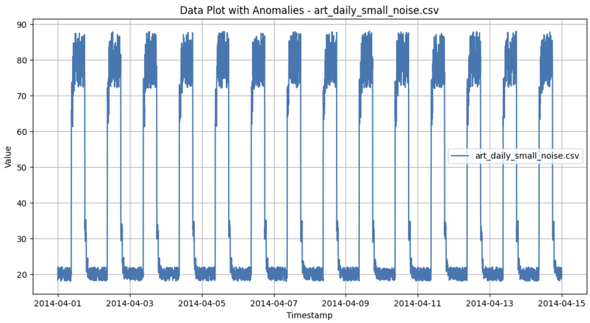
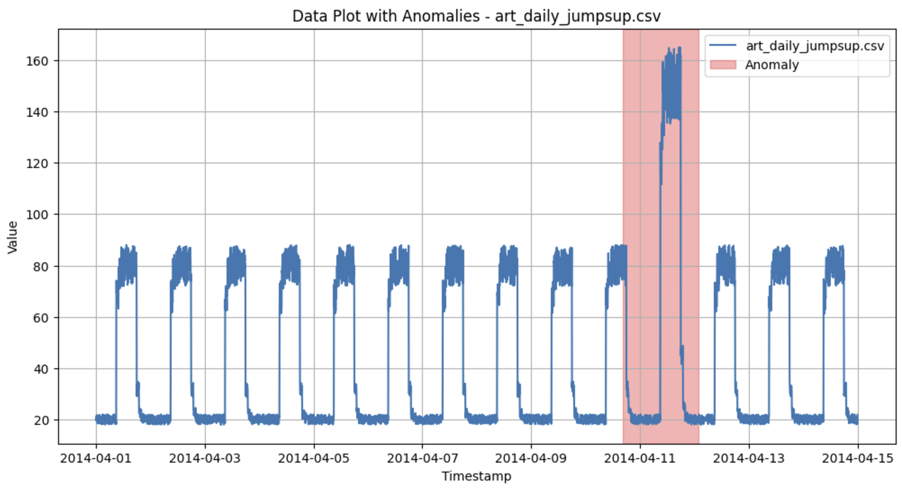
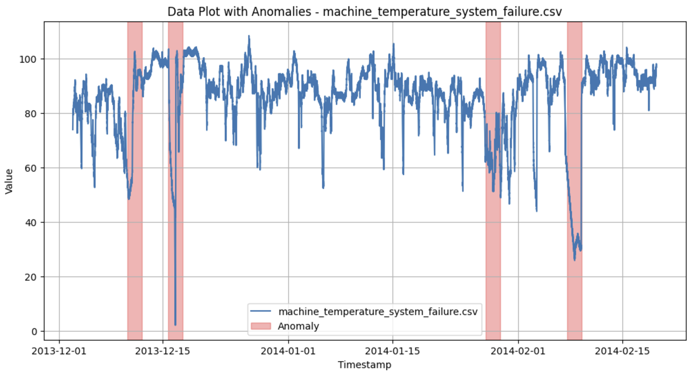

# **IEcapstone** in the Department of Industrial Engineering at Hanyang University
## Description
- 산업공학캡스톤PBL 수업의 일환으로, Ensemble of Sparsely connected RNN and Autoencoder for Anomaly Detection in Financial Time Series을 주제로 실험을 진행하였습니다.
- pytorch framework로 base & advanced model을 구현한 코드는 https://github.com/abcd-EGH/srnn-ae 에서 확인 가능합니다.
- REFERENCE: **Tung Kieu, Bin Yang, Chenjuan Guo, Christian S. Jensen, Outlier Detection for Time Series with Recurrent Autoencoder Ensembles, IJCAI 2019.**, https://github.com/tungk/OED
## Abstact
### Dataset
- The Numenta Anomaly Benchmark (NAB)
    - https://github.com/numenta/NAB
    - https://doi.org/10.5281/zenodo.1040335

### Defaults for Hyper-Parameter
- Limitation of skip steps(L) = 10 (L: length of skip connection, this ensemble model randomly selects the L of each AutoEncoder.)
- Number of AutoEncoder in Ensemble model = 10 (N)
- Hidden size of cell = 10
- Learning rate = 0.001 (used in the reference paper)
- Window size = 288 (follows daliy length of the NAB dataset)
- Random Seed = 777 (for reproducibility)

## H0
### Model
- **BLAE** (**B**i-directional **L**STM and **A**uto**E**ncoder)
- NO Sparsely & Skip Connections and Ensembles
### Train
- Dataset: artificialNoAnomaly/**art_daily_no_noise**.csv
### Test
- Dataset: artificialWithAnomaly/**art_daily_jumpsup**.csv

## H1
### Model
- **ESLAE** (**E**nsemble of **S**parsely connection **L**STM and **A**uto**E**ncoder)
- Base Model w/ Sparsely & Skip Connections and Ensembles
### Train
- Dataset: artificialNoAnomaly/**art_daily_small_noise**.csv
- stride = **4**
- epochs = **75**
### Test
- Dataset: artificialWithAnomaly/**art_daily_jumpsup**.csv

## H1_1
### Model
- **ESLAE** (**E**nsemble of **S**parsely connection **L**STM and **A**uto**E**ncoder)
- Base Model w/ Sparsely Connections and Ensembles
### Train
- Dataset: artificialNoAnomaly/**art_daily_small_noise**.csv
- stride = **8**
- epochs = **75**
### Test
- Dataset: artificialWithAnomaly/**art_daily_jumpsup**.csv

## H1_2
### Model
- **ESLAE** (**E**nsemble of **S**parsely connection **L**STM and **A**uto**E**ncoder)
- Base Model w/ Sparsely Connections and Ensembles
### Train
- Dataset: realKnownCause/**machine_temperature_system_failure**.csv (**exclude anomaly**)
- stride = **12**
- epochs = **75**
### Test
- Dataset: realKnownCause/**machine_temperature_system_failure**.csv (**include anomaly**)

## H2
### Model
- **ERSLAE** (**E**nsemble of **Residual** & **S**parsely connection **L**STM and **A**uto**E**ncoder)
- Advanced Model w/ Residual & Sparsely Connections and Ensembles
### Train
- Dataset: artificialNoAnomaly/**art_daily_small_noise**.csv
- stride = **8**
- epochs = **30**
### Test
- Dataset: artificialWithAnomaly/**art_daily_jumpsup**.csv

## H2_1
### Model
- **ERSLAE** (**E**nsemble of **R**esidual & **S**parsely connection **L**STM and **A**uto**E**ncoder)
- Advanced Model w/ Residual & Sparsely Connections and Ensembles
### Train
- Dataset: realKnownCause/**machine_temperature_system_failure**.csv (**exclude anomaly**)
- stride = **12**
- epochs = **15**
### Test
- Dataset: realKnownCause/**machine_temperature_system_failure**.csv (**include anomaly**)

## H3
### Model
- **ECSLAE** (**E**nsemble of **C**oncatenation-based skip (Encoder-Decoder) & **S**parsely connection **L**STM and **A**uto**E**ncoder)
- Advanced Model w/ Residual & Sparsely Connections and Ensembles
### Train
- Dataset: realKnownCause/**machine_temperature_system_failure**.csv (**exclude anomaly**)
- stride = **12**
- epochs = **20**
### Test
- Dataset: realKnownCause/**machine_temperature_system_failure**.csv (**include anomaly**)

## H4
### (In progress)

## Preview of Used Datasets
- art_daily_no_noise (used in H0) 

- art_daily_small_noise (used in H1, H1_1, H2) 

- art_daily_jumpsup (used in H0, H1_1, H2) 

- machine_temperature_system_failure (used in H1_2, H2_1, H3) 
